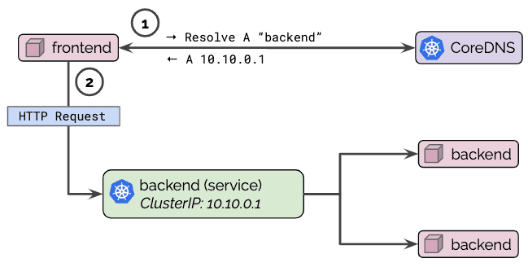

# Deploying dns with addon CoreDNS

[https://kubernetes.io/docs/concepts/services-networking/dns-pod-service/](https://kubernetes.io/docs/concepts/services-networking/dns-pod-service/)

[https://medium.com/kubernetes-tutorials/kubernetes-dns-for-services-and-pods-664804211501](https://medium.com/kubernetes-tutorials/kubernetes-dns-for-services-and-pods-664804211501)

Kubernetes cung cấp một dịch vụ DNS cluster addon mà tự động gán tên dns cho các service. Bởi DNS service này mà các ứng dụng có thể tìm và giao tiếp với nhau dễ dàng hơn trong Kubernetes cluster.

Thực tế, chúng ta ứng dụng DNS để cho phép frontend service đến các frontend service khác hoặc gọi đến backend service với dns name.

<p align="center">

</p>

Trong phần này, chúng ta triển khai DNS Cluster với addon là CoreDNS để làm dịch vụ DNS cho Kubernetes.

`kubectl apply -f https://storage.googleapis.com/kubernetes-the-hard-way/coredns-1.7.0.yaml`

List các pod được tạo bởi kube-dns deployment

```
[root@master1 ~]# kubectl get pods -l k8s-app=kube-dns -n kube-system
NAME                       READY   STATUS    RESTARTS   AGE
coredns-5c7b64c8d9-tk965   1/1     Running   0          5h45m
coredns-5c7b64c8d9-z67gv   1/1     Running   0          5h45m
```

Check DNS cluster đang chạy

```
[root@master1 deployments]# kubectl get services --namespace=kube-system

NAME       TYPE        CLUSTER-IP   EXTERNAL-IP   PORT(S)                  AGE
kube-dns   ClusterIP   10.96.0.10   <none>        53/UDP,53/TCP,9153/TCP   6d20h
```

Khi đó, DNS server đang chạy với tên service là kube-dns và CLUSTER-IP là 10.96.0.10

Thử check DNS bằng công cụ nslookup

- Check service đang chạy

```
[root@master1 deployments]# kubectl get svc
NAME                TYPE        CLUSTER-IP       EXTERNAL-IP   PORT(S)        AGE
default-subdomain   ClusterIP   None             <none>        1234/TCP       5d4h
kubernetes          ClusterIP   10.96.0.1        <none>        443/TCP        6d20h
nginx               NodePort    10.110.187.129   <none>        80:31868/TCP   9s
```

- Check pod đang chạy

```
[root@master1 deployments]# kubectl get pods
NAME                     READY   STATUS    RESTARTS   AGE
nginx-6799fc88d8-hvgxk   1/1     Running   0          52s
```

Khi đó đứng từ pod nginx-6799fc88d8-hvgxk và query xem nginx service ra kết quả thế nào

```
[root@master1 deployments]# kubectl exec -it nginx-6799fc88d8-hvgxk -- /bin/bash
root@nginx-6799fc88d8-hvgxk:/# cat /etc/resolv.conf 
nameserver 10.96.0.10
search default.svc.cluster.local svc.cluster.local cluster.local
options ndots:5
```

Ở đây ta đang truy cập vào pod nginx-6799fc88d8-hvgxk và show thông tin reference dns server đang cấu hình

Thực hiện nslookup nginx service với FQDN

```
root@nginx-6799fc88d8-hvgxk:/# busybox nslookup nginx.default.svc.cluster.local
Server:		10.96.0.10
Address:	10.96.0.10:53
Name:	nginx.default.svc.cluster.local
Address: 10.110.187.129
```

Hoặc chỉ cần query với 

Thử check dns name bằng ví dụ khác

- Tạo deployment

Tạo tệp tin deployment01.yml với nội dung sau:

```
apiVersion: apps/v1
kind: Deployment
metadata:
  name: my-nginx
spec:
  selector:
    matchLabels:
      run: my-nginx
  replicas: 2
  template:
    metadata:
      labels:
        run: my-nginx
    spec:
      containers:
      - name: my-nginx
        image: nginx
        ports:
        - containerPort: 80
```

Thực hiện tạo deployment với name là my-nginx

```
[root@master1 deployments]# kubectl create -f  deployment01.yml
deployment.apps/deployment01 created
```

- Tạo service

Tạo tệp tin service01.yml với nội dung sau:

```
apiVersion: v1
kind: Service
metadata:
  name: my-nginx
  labels:
    run: my-nginx
spec:
  ports:
  - port: 80
    protocol: TCP
  selector:
    run: my-nginx
```

Thực hiện tạo service với name là my-nginx

```
[root@master1 services]# kubectl create -f service01.yml 
service/service01 created
```
Khi đó service mới có tên dns là service01

```
[root@master1 services]# kubectl get svc -o wide
NAME                TYPE        CLUSTER-IP       EXTERNAL-IP   PORT(S)        AGE     SELECTOR
default-subdomain   ClusterIP   None             <none>        1234/TCP       5d5h    name=busybox
kubernetes          ClusterIP   10.96.0.1        <none>        443/TCP        6d21h   <none>
nginx               NodePort    10.110.187.129   <none>        80:31868/TCP   24m     app=nginx
service01           ClusterIP   10.103.36.128    <none>        4000/TCP       3m13s   app=test-pod
```
Khi đó, chúng ta có thể đứng từ một pod client nào đó để query dns name my-nginx xem nó phân giải ra địa chỉ gì

```
root@nginx-6799fc88d8-hvgxk:/# nslookup my-nginx
Server:		10.96.0.10
Address:	10.96.0.10#53

Name:	my-nginx.default.svc.cluster.local
Address: 10.106.47.79
```
Ta thấy, dns server (10.96.0.10) phân giải my-nginx với FQDN là my-nginx.default.svc.cluster.local  và địa chỉ IP 10.106.47.79

Hay thử curl my-nginx service xem sao

```
root@nginx-6799fc88d8-hvgxk:/# curl http://my-nginx
<!DOCTYPE html>
<html>
<head>
<title>Welcome to nginx!</title>
<style>
    body {
        width: 35em;
        margin: 0 auto;
        font-family: Tahoma, Verdana, Arial, sans-serif;
    }
</style>
</head>
<body>
<h1>Welcome to nginx!</h1>
<p>If you see this page, the nginx web server is successfully installed and
working. Further configuration is required.</p>

<p>For online documentation and support please refer to
<a href="http://nginx.org/">nginx.org</a>.<br/>
Commercial support is available at
<a href="http://nginx.com/">nginx.com</a>.</p>

<p><em>Thank you for using nginx.</em></p>
</body>
</html>
```
