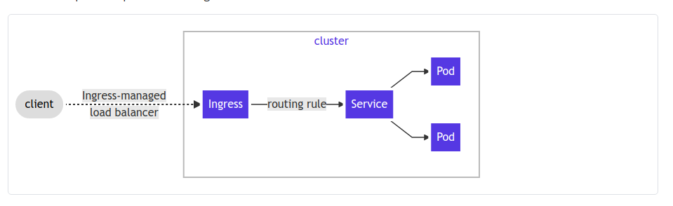

# Setup Ingress Nginx

[https://kubernetes.io/docs/concepts/services-networking/ingress/](https://kubernetes.io/docs/concepts/services-networking/ingress/)

## 1.About Ingress in Kubernetes

Ingress là thành phần (API) quản lý các request http/https từ bên ngoài vào bên trong các dịch vụ trong một cluster của hệ thống Kubernetes.

Ingress có thể cung cấp Load Balancing, SSL termination và name-based virtual host. Để Ingress điều hướng đến các kiểu services, thường là NodePort hoặc LoadBalancer.

Để sử dụng Ingress, yêu cầu cần có một Ingress Controller. Ingress Controller phổ biến được sử dụng là nginx, haproxy hoặc traefik

<p align="center">

</p>

## 2.Setup Ingress Nginx

Trong phần này, ta thiết lập Nginx như một Ingress Controller

<p align="center">

</p>

Cách setup đơn giản là dùng helm để install nginx web proxy

[https://kubernetes.github.io/ingress-nginx/deploy/#using-helm](https://kubernetes.github.io/ingress-nginx/deploy/#using-helm)

``
helm repo add ingress-nginx https://kubernetes.github.io/ingress-nginx
helm repo update
helm install ingress-nginx ingress-nginx/ingress-nginx
helm upgrade ingress-nginx stable/nginx-ingress --set controller.publishService.enabled=true
```

Quá trình thực hiện cài đặt

`helm install ingress-nginx ingress-nginx/ingress-nginx`

```
NAME: ingress-nginx
LAST DEPLOYED: Tue Dec  8 01:02:35 2020
NAMESPACE: default
STATUS: deployed
REVISION: 1
TEST SUITE: None
NOTES:
The ingress-nginx controller has been installed.
It may take a few minutes for the LoadBalancer IP to be available.
You can watch the status by running 'kubectl --namespace default get services -o wide -w ingress-nginx-controller'

An example Ingress that makes use of the controller:

  apiVersion: networking.k8s.io/v1beta1
  kind: Ingress
  metadata:
    annotations:
      kubernetes.io/ingress.class: nginx
    name: example
    namespace: foo
  spec:
    rules:
      - host: www.example.com
        http:
          paths:
            - backend:
                serviceName: exampleService
                servicePort: 80
              path: /
    # This section is only required if TLS is to be enabled for the Ingress
    tls:
        - hosts:
            - www.example.com
          secretName: example-tls

If TLS is enabled for the Ingress, a Secret containing the certificate and key must also be provided:

  apiVersion: v1
  kind: Secret
  metadata:
    name: example-tls
    namespace: foo
  data:
    tls.crt: <base64 encoded cert>
    tls.key: <base64 encoded key>
  type: kubernetes.io/tls
```

Khi đó Nginx service được triển khai ở chế độ LoadBalancer, và nếu hệ thống sử dụng MetalLB thì nó được cấp phát một địa chỉ VIP. Có thể show như thông tin bên dưới:

- Check phiên bản cài đặt

```
[root@master1 ~]# POD_NAME=$(kubectl get pods -l app.kubernetes.io/name=ingress-nginx -o jsonpath='{.items[0].metadata.name}')
[root@master1 ~]# kubectl exec -it $POD_NAME -- /nginx-ingress-controller --version
-------------------------------------------------------------------------------
NGINX Ingress controller
  Release:       v0.41.2
  Build:         d8a93551e6e5798fc4af3eb910cef62ecddc8938
  Repository:    https://github.com/kubernetes/ingress-nginx
  nginx version: nginx/1.19.4

-------------------------------------------------------------------------------
```

- Show thông tin service ingress-nginx

```
[root@master1 deployments]# kubectl get svc
NAME                                                     TYPE           CLUSTER-IP       EXTERNAL-IP   PORT(S)                      AGE
default-subdomain                                        ClusterIP      None             <none>        1234/TCP                     37d
ingress-nginx-nginx-ingress-controller                   LoadBalancer   10.106.96.184    <pending>     80:30319/TCP,443:32558/TCP   78m
ingress-nginx-nginx-ingress-default-backend              ClusterIP      10.106.136.132   <none>        80/TCP                       78m
kubernetes                                               ClusterIP      10.96.0.1        <none>        443/TCP                      39d
nginx-ingress-ssl                                        LoadBalancer   10.106.238.40    <pending>     443:30761/TCP                9m4s
```

Trong trường hợp này, chúng ta thấy ingress-nginx-nginx-ingress-controller chỉ ra giá trị <pending> ở cột EXTERNAL-IP, khi đó có thể thao tác fix (patch) thủ công như sau:

`kubectl patch svc ingress-nginx-nginx-ingress-controller -p '{"spec": {"type": "LoadBalancer", "externalIPs":["192.168.10.220"]}}'`

Trong đó 192.168.10.220 là VIP của master nodes trong kubernetes cluster.

**Note**: thay thông tin tên service, namespace và externalIP phù hợp

Show lại thông tin service

```
[root@master1 deployments]# kubectl get svc
NAME                                                     TYPE           CLUSTER-IP       EXTERNAL-IP      PORT(S)                      AGE
default-subdomain                                        ClusterIP      None             <none>           1234/TCP                     37d
ingress-nginx-nginx-ingress-controller                   LoadBalancer   10.106.96.184    192.168.10.220   80:30319/TCP,443:32558/TCP   79m
ingress-nginx-nginx-ingress-default-backend              ClusterIP      10.106.136.132   <none>           80/TCP                       79m
kubernetes                                               ClusterIP      10.96.0.1        <none>           443/TCP                      39d
nginx-ingress-ssl                                        LoadBalancer 10.106.238.40    <pending>        443:30761/TCP                9m43s
```

Đứng ở LAN network, telnet port 80/443 đến 192.168.10.220

## 3.Exposing the App Using an Ingress

Trong phần này, chúng ta deployment một application và thực hiện expose nó qua một ingress.

**Step1: Creating a deployment, a service**

Ví dụ tạo deployment để triển khai web, sử dụng image nginx

```
apiVersion: v1
kind: Namespace
metadata:
  name: crm
---
apiVersion: v1
kind: Service
metadata:
  name: web-crm
  namespace: crm
spec:
  ports:
  - port: 80
    protocol: TCP
    targetPort: 80
  selector:
    run: web-crm
  sessionAffinity: None
  type: LoadBalancer
---
apiVersion: apps/v1
kind: Deployment
metadata:
  labels:
    run: web-crm
  name: web-crm
  namespace: crm
spec:
  replicas: 2
  selector:
    matchLabels:
      run: web-crm
  template:
    metadata:
      labels:
        run: web-crm
    spec:
      containers:
      - image: nginx
        imagePullPolicy: IfNotPresent
        name: http
        ports:
        - containerPort: 80
          protocol: TCP
        resources: {}
```

Khi đó thực hiện tạo deployment, service từ tệp tin đã tạo trên

`[root@master1 cert-manager]# kubectl apply -f expose-ingress-nginx.yaml `

```
namespace/crm created
service/web-crm created
deployment.apps/web-crm created
```

**Step2: Expose a service using ingress**

Thực hiện expose service web-crm với domain là crm.example.com, expose port 80

Tạo tệp tin ingress-crm.yaml với nội dung sau:

```
apiVersion: networking.k8s.io/v1
kind: Ingress
metadata:
  name: web-crm
  namespace: crm
spec:
  rules:
  - host: crm.example.com
    http:
      paths:
      - path: /
        pathType: Prefix
        backend:
          service:
            name: web-crm
            port:
              number: 80
```

Check ingress

`[root@master1 cert-manager]# kubectl get Ingress -n crm`

```
Warning: extensions/v1beta1 Ingress is deprecated in v1.14+, unavailable in v1.22+; use networking.k8s.io/v1 Ingress
NAME      CLASS    HOSTS             ADDRESS          PORTS   AGE
web-crm   <none>   crm.example.com   192.168.10.220   80      2m6s
```

Khi đó, chúng ta fix host và có thể truy cập web http://crm.example.com

Với trường hợp expose dùng SSL, chúng ta cần thiết lập cấu hình quản lý certificate (Cert-Manager) ở phần sau. Hoặc tạo certificate thủ công như sau:

- Create một TLS certificate

`openssl req -x509 -sha256 -nodes -days 365 -newkey rsa:2048 -keyout tls.key -out tls.crt -subj "/CN=crm/O=Example"`

- Tạo một secret cho domain crm.example.com

`kubectl -n crm create secret tls crm-example --key tls.key --cert tls.crt`

- Tạo tệp tin crm-ingress.yaml với nội dung sau

```
apiVersion: networking.k8s.io/v1
kind: Ingress
metadata:
  name: web-crm
  namespace: crm
spec:
  tls:
    - hosts:
      - crm.example.com
      secretName: crm-example
  rules:
  - host: crm.example.com
    http:
      paths:
      - path: /
        pathType: Prefix
        backend:
          service:
            name: web-crm
            port:
              number: 80
```

Ở đây, tạo Ingress là web-crm với các thông tin tls cho domain crm.example.com và secret crm-example đã tạo ở bước trên
