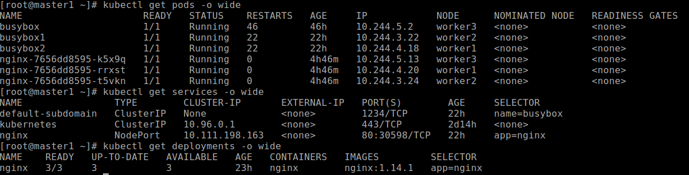

# Setup K8S on CentOS 7

**Phân hoạch địa chỉ IP cho các node như sau:**

|NAME              |IP               |ROLE  |
|------------------|-----------------|------|
|Master1           |192.168.10.222   |Master|
|Master2           |192.168.10.223   |Master|
|Master3           |192.168.10.224   |Master|
|Worker1           |192.168.10.212   |Worker|
|Worker2           |192.168.10.213   |Worker|
|Worker3           |192.168.10.214   |Worker|

**Control-plane node(s)**

|Protocol      |Direction |Port Range |Purpose                 |Used By              |
|--------------|----------|-----------|------------------------|---------------------|
|TCP           |Inbound   |6443*      |Kubernetes API server   |All                  |
|TCP           |Inbound   |2379-2380  |etcd server client API  |kube-apiserver, etcd |
|TCP           |Inbound   |10250      |Kubelet API             |Self, Control plane  |
|TCP           |Inbound   |10251      |kube-scheduler          |Self                 |
|TCP           |Inbound   |10252      |kube-controller-manager |Self                 |

**Worker node(s)**

|Protocol      |Direction |Port Range |Purpose                 |Used By              |
|--------------|----------|-----------|------------------------|---------------------|
|TCP           |Inbound   |10250      |Kubelet API             |Self, Control plane  |
|TCP           |Inbound   |30000-32767|NodePort Services       |All                  |

## 1. Preparing

Step1: Setup hosts trên các node

```
cat <<EOF>>/etc/hosts
192.168.10.222 master1
192.168.10.223 master2
192.168.10.224 master3
192.168.10.212 worker1
192.168.10.213 worker2
192.168.10.214 worker3
EOF
```

**Step2: Disable Selinux**

```
setenforce 0
sed -i --follow-symlinks 's/SELINUX=enforcing/SELINUX=disabled/g' /etc/sysconfig/selinux
```

**Step3: Enable br_netfilter Kernel Module**

```
modprobe br_netfilter
echo '1' > /proc/sys/net/bridge/bridge-nf-call-iptables
```

**Note:** Required kernel > 3.10.0.1xxx. Trong trường hợp Linux kernel thấp hơn, khi enable br_netfilter thì xảy ra lỗi

**Step4: Disable swap**

```
swapoff -a
sed -i 's/^.*swap/#&/' /etc/fstab
```

**Step5: Enable Forwarding**

```
iptables -P FORWARD ACCEPT 
cat >/etc/sysctl.d/k8s.conf <<EOF
net.bridge.bridge-nf-call-ip6tables = 1
net.bridge.bridge-nf-call-iptables = 1
net.ipv4.ip_forward = 1
vm.swappiness=0
EOF
sysctl --system
```

**Step6: Install and configure Docker**

```
wget https://download.docker.com/linux/static/stable/x86_64/docker-18.06.3-ce.tgz
tar -zxvf docker-18.06.3-ce.tgz
cd docker
cp * /usr/local/bin
```

Hoặc cài đặt docker-ce từ repo sau:

```
curl https://download.docker.com/linux/centos/docker-ce.repo -o /etc/yum.repos.d/docker-ce.repo
yum install -y docker-ce
```

Thiết lập cgroup-driver với systemd và storage-driver với overlay2. Mặc định cgroup-driver chạy với cgroupfs và storage-driver sử dụng devicemapper.

Tạo tệp tin /etc/docker/daemon.json với nội dung sau:

```
mkdir -p /etc/docker
cat <<EOF>/etc/docker/daemon.json
{
  "exec-opts": ["native.cgroupdriver=systemd"],
  "log-driver": "json-file",
  "log-opts": {
    "max-size": "100m"
  },
  "storage-driver": "overlay2",
  "storage-opts": [
    "overlay2.override_kernel_check=true"
  ]
}
EOF
```

Enable Docker service and reload configuration by running the following commands

```
systemctl daemon-reload 
systemctl enable docker 
systemctl restart docker
```

Check docker information

```
[root@master1 ~]# docker info |grep -i cgroup
 Cgroup Driver: systemd
[root@master1 ~]# docker info |grep -i storage
 Storage Driver: overlay2
```

**Step7: Install kubeadm, kubectl and kubelet**

- Create repository

```
cat >/etc/yum.repos.d/kubernetes.repo<<EOF
[kubernetes]
name=Kubernetes
baseurl=https://packages.cloud.google.com/yum/repos/kubernetes-el7-x86_64
enabled=1
gpgcheck=1
repo_gpgcheck=1
gpgkey=https://packages.cloud.google.com/yum/doc/yum-key.gpg https://packages.cloud.google.com/yum/doc/rpm-package-key.gpg
EOF
```
- Installing kubelet, kubeadm, kubectl

`yum makecache fast && yum install -y kubelet kubeadm kubectl`

Trong trường hợp docker sử dụng cgroup là systemd, khi đó chúng ta điều chỉnh cấu hình kubelet để sử dụng systemd (mặc định cgroupfs)

```
cat <<EOF>/usr/lib/systemd/system/kubelet.service
[Unit]
Description=kubelet: The Kubernetes Node Agent
Documentation=https://kubernetes.io/docs/
Wants=network-online.target
After=network-online.target

[Service]
ExecStart=/usr/bin/kubelet --cgroup-driver=systemd
Restart=always
StartLimitInterval=0
RestartSec=10

[Install]
WantedBy=multi-user.target
EOF
```

## 2. Setup Kubernetes cluster

### 2.1 Generating Master Configuration Files

Thiết lập cấu hình trên Master1(192.168.10.222) và sau đó copy các thông tin cấu hình đó đến các master node còn lại.

Download Cloudflare's PKI and TLS toolkit

```
curl -o /usr/local/bin/cfssl https://pkg.cfssl.org/R1.2/cfssl_linux-amd64
curl -o /usr/local/bin/cfssljson https://pkg.cfssl.org/R1.2/cfssljson_linux-amd64
chmod +x /usr/local/bin/cfssl*
```

Chúng ta thực hiện tạo các tệp tin json chứa thông tin để tạo self-signed certificates

```
mkdir /opt/ssl && cd /opt/ssl
cat <<EOF>ca-config.json
{
  "signing": {
    "default": {
      "expiry": "8760h"
    },
    "profiles": {
      "kubernetes": {
        "usages": [
            "signing",
            "key encipherment",
            "server auth",
            "client auth"
        ],
        "expiry": "87600h"
      }
    }
  }
}
EOF

cat <<EOF>ca-csr.json
{
  "CN": "kubernetes",
  "key": {
    "algo": "rsa",
    "size": 2048
  },
  "names": [
    {
      "C": "VN",
      "ST": "HN",
      "L": "HN",
      "O": "k8s",
      "OU": "system"
    }
  ]
}
EOF

cat <<EOF>etcd-csr.json 
{
  "CN": "etcd",
  "hosts": [
    "127.0.0.1",
    "192.168.10.222",
    "192.168.10.223",
    "192.168.10.224"
  ],
  "key": {
    "algo": "rsa",
    "size": 2048
  },
  "names": [
    {
      "C": "VN",
      "ST": "HN",
      "L": "HN",
      "O": "k8s",
      "OU": "System"
    }
  ]
}
EOF
```

Ở đây, chúng ta tạo tệp cấu hình với expire là 365 days (8760h), với các thuộc tính self-signed (CSR) tùy chọn cho cả ca và etcd

Thực hiện tạo certificate

```
cd /opt/ssl
cfssl gencert -initca ca-csr.json | cfssljson -bare ca # cfssl gencert -ca=ca.pem -ca-key=ca-key.pem -config=ca-config.json -profile=kubernetes etcd-csr.json | cfssljson -bare etcd
```

### 2.2 Setup ETCD Cluster

[https://kubernetes.io/docs/tasks/administer-cluster/configure-upgrade-etcd/](https://kubernetes.io/docs/tasks/administer-cluster/configure-upgrade-etcd/)

Tạo thư mục cấu hình và copy các tệp certificate đã tạo ở bước trên đến các node master

```
mkdir -p /etc/etcd/ssl && mkdir -p /var/lib/etcd
cd /opt/ssl/
scp *.pem 192.168.10.222:/etc/etcd/ssl/
scp *.pem 192.168.10.223:/etc/etcd/ssl/
scp *.pem 192.168.10.224:/etc/etcd/ssl/
```

Trên các node master, download gói etcd (hoặc có thể cài đặt etcd từ binary package)

```
ETCD_VER=v3.4.13
wget https://github.com/etcd-io/etcd/releases/download/${ETCD_VER}/etcd-${ETCD_VER}-linux-amd64.tar.gz 
tar -zxvf etcd-${ETCD_VER}-linux-amd64.tar.gz
cp etcd-${ETCD_VER}-linux-amd64/etcd* /usr/local/bin/
```

**Chạy etcd như systemd**

Thực hiện tạo tệp tin /etc/systemd/system/etcd.service trên các node master như sau:

**Trên master1**

```
cat <<EOF>/etc/systemd/system/etcd.service
[Unit]
Description=etcd
Documentation=https://github.com/coreos

[Service]
ExecStart=/usr/local/bin/etcd \
  --name master1 \
  --cert-file=/etc/etcd/ssl/etcd.pem \
  --key-file=/etc/etcd/ssl/etcd-key.pem \
  --peer-cert-file=/etc/etcd/ssl/etcd.pem \
  --peer-key-file=/etc/etcd/ssl/etcd-key.pem \
  --trusted-ca-file=/etc/etcd/ssl/ca.pem \
  --peer-trusted-ca-file=/etc/etcd/ssl/ca.pem \
  --peer-client-cert-auth \
  --client-cert-auth \
  --initial-advertise-peer-urls https://192.168.10.222:2380 \
  --listen-peer-urls https://192.168.10.222:2380 \
  --listen-client-urls https://192.168.10.222:2379,http://127.0.0.1:2379 \
  --advertise-client-urls https://192.168.10.222:2379 \
  --initial-cluster-token etcd-cluster-0 \
  --initial-cluster master1=https://192.168.10.222:2380,master2=https://192.168.10.223:2380,master3=https://192.168.10.224:2380 \
  --initial-cluster-state new \
  --data-dir=/var/lib/etcd
Restart=on-failure
RestartSec=5

[Install]
WantedBy=multi-user.target
EOF
```

**Trên master2**

```
cat <<EOF>/etc/systemd/system/etcd.service
[Unit]
Description=etcd
Documentation=https://github.com/coreos

[Service]
ExecStart=/usr/local/bin/etcd \
  --name master2 \
  --cert-file=/etc/etcd/ssl/etcd.pem \
  --key-file=/etc/etcd/ssl/etcd-key.pem \
  --peer-cert-file=/etc/etcd/ssl/etcd.pem \
  --peer-key-file=/etc/etcd/ssl/etcd-key.pem \
  --trusted-ca-file=/etc/etcd/ssl/ca.pem \
  --peer-trusted-ca-file=/etc/etcd/ssl/ca.pem \
  --peer-client-cert-auth \
  --client-cert-auth \
  --initial-advertise-peer-urls https://192.168.10.223:2380 \
  --listen-peer-urls https://192.168.10.223:2380 \
  --listen-client-urls https://192.168.10.223:2379,http://127.0.0.1:2379 \
  --advertise-client-urls https://192.168.10.223:2379 \
  --initial-cluster-token etcd-cluster-0 \
  --initial-cluster master1=https://192.168.10.222:2380,master2=https://192.168.10.223:2380,master3=https://192.168.10.224:2380 \
  --initial-cluster-state new \
  --data-dir=/var/lib/etcd
Restart=on-failure
RestartSec=5

[Install]
WantedBy=multi-user.target
EOF
```

**Trên master3**

```
cat <<EOF>/etc/systemd/system/etcd.service
[Unit]
Description=etcd
Documentation=https://github.com/coreos

[Service]
ExecStart=/usr/local/bin/etcd \
  --name master3 \
  --cert-file=/etc/etcd/ssl/etcd.pem \
  --key-file=/etc/etcd/ssl/etcd-key.pem \
  --peer-cert-file=/etc/etcd/ssl/etcd.pem \
  --peer-key-file=/etc/etcd/ssl/etcd-key.pem \
  --trusted-ca-file=/etc/etcd/ssl/ca.pem \
  --peer-trusted-ca-file=/etc/etcd/ssl/ca.pem \
  --peer-client-cert-auth \
  --client-cert-auth \
  --initial-advertise-peer-urls https://192.168.10.224:2380 \
  --listen-peer-urls https://192.168.10.224:2380 \
  --listen-client-urls https://192.168.10.224:2379,http://127.0.0.1:2379 \
  --advertise-client-urls https://192.168.10.224:2379 \
  --initial-cluster-token etcd-cluster-0 \
  --initial-cluster master1=https://192.168.10.222:2380,master2=https://192.168.10.223:2380,master3=https://192.168.10.224:2380 \
  --initial-cluster-state new \
  --data-dir=/var/lib/etcd
Restart=on-failure
RestartSec=5
LimitNOFILE=65536

[Install]
WantedBy=multi-user.target
EOF
```

Thực hiện start etcd trên các node master

```
systemctl daemon-reload
systemctl start etcd
systemctl enable etcd
```

Show list các member trong etcd cluster

```
[root@k8s-master1 ssl]# ETCDCTL_API=3 etcdctl --write-out=table member list
+------------------+---------+---------+-----------------------------+-----------------------------+
|        ID        | STATUS  |  NAME   |         PEER ADDRS          |        CLIENT ADDRS         |
+------------------+---------+---------+-----------------------------+-----------------------------+
| 6c2d972ad2f207ae | started | master2 | https://192.168.10.223:2380 | https://192.168.10.223:2379 |
| bbdda184f3697244 | started | master3 | https://192.168.10.224:2380 | https://192.168.10.224:2379 |
| d28b4bf0112bab15 | started | master1 | https://192.168.10.222:2380 | https://192.168.10.222:2379 |
```

Note: 

- Tùy thuộc vào mô hình và số lượng member trong etcd cluster, chúng ta có thể gỡ bỏ hoặc bổ sung mới member vào etcd cluster.

- Cấu hình một số tùy chọn khác như backup/restore, upgrade, ..

## 2.3 Initial Kubernetes Cluster

### 2.3.1 On Master01

Tạo tệp tin kubeadm-config.yaml với nội dung đơn giản như sau:

```
cat <<EOF>kubeadm-config.yaml
apiVersion: kubeadm.k8s.io/v1beta2
kind: ClusterConfiguration
kubernetesVersion: stable
etcd:
  external:
    endpoints:
    - https://192.168.10.222:2379
    - https://192.168.10.223:2379
    - https://192.168.10.224:2379
    caFile: /etc/etcd/ssl/ca.pem
    certFile: /etc/etcd/ssl/etcd.pem
    keyFile: /etc/etcd/ssl/etcd-key.pem
networking:
  podSubnet: 10.244.0.0/16
EOF
```

Note: Trong trường sử dụng HAProxy làm LB cho Kubernetes, khi đó khai báo địa chỉ VIP làm giá trị cho *controlPlaneEndPoint*, thực hiện tạo tệp cấu hình như sau:

```
cat <<EOF>kubeadm-config.yaml
apiVersion: kubeadm.k8s.io/v1beta2
kind: ClusterConfiguration
kubernetesVersion: stable
controlPlaneEndpoint: "192.168.10.10:6443"
etcd:
  external:
    endpoints:
    - https://192.168.10.222:2379
    - https://192.168.10.223:2379
    - https://192.168.10.224:2379
    caFile: /etc/etcd/ssl/ca.pem
    certFile: /etc/etcd/ssl/etcd.pem
    keyFile: /etc/etcd/ssl/etcd-key.pem
networking:
  podSubnet: 10.244.0.0/16
EOF
```

Thực hiện lệnh sau để khởi tạo các dịch vụ Kubernetes Master (Control-plane)

`kubeadm init --config kubeadm-config.yaml`

Quá trình khởi tạo như sau

```
[root@master1 ~]# kubeadm init --config kubeadm-config.yaml
W1030 12:02:58.484188   32057 configset.go:348] WARNING: kubeadm cannot validate component configs for API groups [kubelet.config.k8s.io kubeproxy.config.k8s.io]
[init] Using Kubernetes version: v1.19.3
[preflight] Running pre-flight checks
[preflight] Pulling images required for setting up a Kubernetes cluster
[preflight] This might take a minute or two, depending on the speed of your internet connection
[preflight] You can also perform this action in beforehand using 'kubeadm config images pull'
[certs] Using certificateDir folder "/etc/kubernetes/pki"
[certs] Generating "ca" certificate and key
[certs] Generating "apiserver" certificate and key
[certs] apiserver serving cert is signed for DNS names [kubernetes kubernetes.default kubernetes.default.svc kubernetes.default.svc.cluster.local master1] and IPs [10.96.0.1 192.168.10.222]
[certs] Generating "apiserver-kubelet-client" certificate and key
[certs] Generating "front-proxy-ca" certificate and key
[certs] Generating "front-proxy-client" certificate and key
[certs] External etcd mode: Skipping etcd/ca certificate authority generation
[certs] External etcd mode: Skipping etcd/server certificate generation
[certs] External etcd mode: Skipping etcd/peer certificate generation
[certs] External etcd mode: Skipping etcd/healthcheck-client certificate generation

...

Your Kubernetes control-plane has initialized successfully!

To start using your cluster, you need to run the following as a regular user:

  mkdir -p $HOME/.kube
  sudo cp -i /etc/kubernetes/admin.conf $HOME/.kube/config
  sudo chown $(id -u):$(id -g) $HOME/.kube/config

You should now deploy a pod network to the cluster.
Run "kubectl apply -f [podnetwork].yaml" with one of the options listed at:
  https://kubernetes.io/docs/concepts/cluster-administration/addons/

Then you can join any number of worker nodes by running the following on each as root:

kubeadm join 192.168.10.222:6443 --token x22wmh.tmpbon143eyo4wql \
    --discovery-token-ca-cert-hash sha256:e58926f544f3b973ccfc16160fec68ad22b3b69649734b62267b00e125360d20 
```


Sau khi khởi tạo cluster, hệ thống sinh ra các tệp cấu hình sau:
[root@master1 ~]# ll /etc/kubernetes/manifests/
total 12
-rw------- 1 root root 3188 01:12 29 Th10 kube-apiserver.yaml
-rw------- 1 root root 2829 01:12 29 Th10 kube-controller-manager.yaml
-rw------- 1 root root 1384 01:12 29 Th10 kube-scheduler.yaml

và hệ thống lúc này tạo ra các dịch vụ sau: kube-controller, kube-scheduler, kube-proxy, kube-apiserver
Sau khi khởi tạo Kubernetes control-plane thành công, để chạy kubernetes cluster, cần thiết lập regular user như sau: 
  mkdir -p $HOME/.kube
  sudo cp -i /etc/kubernetes/admin.conf $HOME/.kube/config
  sudo chown $(id -u):$(id -g) $HOME/.kube/config

Thực hiện copy các tệp certificates PKI (Trừ tệp apiserver.crt and apiserver.key) đến 02 master node còn lại
```
rsync -azhP --delete --exclude=apiserver.crt --exclude=apiserver.key /etc/kubernetes/pki root@192.168.10.223:/root/kubernetes/
rsync -azhP --delete --exclude=apiserver.crt --exclude=apiserver.key /etc/kubernetes/pki root@192.168.10.224:/root/kubernetes/
```

### 2.3.2 On Master2

Tạo tệp tin kubeadm-config.yaml với nội dung đơn giản như sau:

```
cat <<EOF>kubeadm-config.yaml
apiVersion: kubeadm.k8s.io/v1beta2
#apiVersion: kubeadm.k8s.io/v1
kind: ClusterConfiguration
kubernetesVersion: stable
etcd:
  external:
    endpoints:
    - https://192.168.10.222:2379
    - https://192.168.10.223:2379
    - https://192.168.10.224:2379
    caFile: /etc/etcd/ssl/ca.pem
    certFile: /etc/etcd/ssl/etcd.pem
    keyFile: /etc/etcd/ssl/etcd-key.pem
networking:
  podSubnet: 10.244.0.0/16
EOF
```

Thực hiện lệnh sau để khởi tạo các dịch vụ Kubernetes Master (Control-plane)

`kubeadm init --config kubeadm-config.yaml`

### 2.3.3 On Master3

Tạo tệp tin kubeadm-config.yaml với nội dung đơn giản như sau:

```
cat <<EOF>kubeadm-config.yaml
apiVersion: kubeadm.k8s.io/v1beta2
#apiVersion: kubeadm.k8s.io/v1
kind: ClusterConfiguration
kubernetesVersion: stable
etcd:
  external:
    endpoints:
    - https://192.168.10.222:2379
    - https://192.168.10.223:2379
    - https://192.168.10.224:2379
    caFile: /etc/etcd/ssl/ca.pem
    certFile: /etc/etcd/ssl/etcd.pem
    keyFile: /etc/etcd/ssl/etcd-key.pem
networking:
  podSubnet: 10.244.0.0/16
EOF
```

Thực hiện lệnh sau để khởi tạo các dịch vụ Kubernetes Master (Control-plane)

`kubeadm init --config kubeadm-config.yaml`

## 2.4 CNI (Container Network Interface)

Một số CNI phổ biến được dùng như Flannel, Calico, Weave, … 

Chúng ta sẽ cấu hình Flannel - Một overlay network đơn giản. Thực hiện triển khai flannel network đến kubenetes cluster như sau

`kubectl apply -f https://raw.githubusercontent.com/coreos/flannel/master/Documentation/kube-flannel.yml`

Note: Trong trường hợp sửa đổi một số trường trong flannel network (chẳng hạn như thay đổi podSubnet: 10.244.0.0/16) khi đó, chúng ta download hẳn tệp cấu hình kube-flannel.yml và sửa đổi thông tin trước khi áp dụng flannet network.

```
[root@master1 ssl]# kubectl get pods --all-namespaces
NAMESPACE     NAME                              READY   STATUS              RESTARTS   AGE
kube-system   coredns-f9fd979d6-8q22k           0/1     ContainerCreating   0          85m
kube-system   coredns-f9fd979d6-9cdmh           0/1     ContainerCreating   0          85m
kube-system   kube-apiserver-master1            1/1     Running             0          86m
kube-system   kube-apiserver-master2            1/1     Running             0          2m4s
kube-system   kube-apiserver-master3            1/1     Running             0          12m
kube-system   kube-controller-manager-master1   1/1     Running             0          86m
kube-system   kube-controller-manager-master2   1/1     Running             0          2m4s
kube-system   kube-controller-manager-master3   1/1     Running             0          12m
kube-system   kube-flannel-ds-4jbtr             1/1     Running             0          61m
kube-system   kube-flannel-ds-amd64-7ks8w       1/1     Running             1          42m
kube-system   kube-flannel-ds-amd64-cf25r       1/1     Running             0          42m
kube-system   kube-flannel-ds-amd64-dwhns       1/1     Running             1          42m
kube-system   kube-flannel-ds-prhs2             1/1     Running             0          61m
kube-system   kube-flannel-ds-zqntf             1/1     Running             14         61m
kube-system   kube-proxy-djlbx                  1/1     Running             0          78m
kube-system   kube-proxy-kwhgv                  1/1     Running             0          82m
kube-system   kube-proxy-s8r85                  1/1     Running             0          85m
kube-system   kube-scheduler-master1            1/1     Running             0          86m
kube-system   kube-scheduler-master2            1/1     Running             0          2m4s
kube-system   kube-scheduler-master3            1/1     Running             0 12m
```

**Check network interfaces**

```
[root@master1 ssl]# ip a
1: lo: <LOOPBACK,UP,LOWER_UP> mtu 65536 qdisc noqueue state UNKNOWN group default qlen 1000
    link/loopback 00:00:00:00:00:00 brd 00:00:00:00:00:00
    inet 127.0.0.1/8 scope host lo
       valid_lft forever preferred_lft forever
    inet6 ::1/128 scope host 
       valid_lft forever preferred_lft forever
2: eth0: <BROADCAST,MULTICAST,UP,LOWER_UP> mtu 1500 qdisc pfifo_fast state UP group default qlen 1000
    link/ether 00:50:56:88:1d:cd brd ff:ff:ff:ff:ff:ff
    inet 192.168.10.222/24 brd 192.168.10.255 scope global noprefixroute eth0
       valid_lft forever preferred_lft forever
    inet6 2402:800:6106:1ef:250:56ff:fe88:1dcd/64 scope global noprefixroute dynamic 
       valid_lft 2591833sec preferred_lft 604633sec
    inet6 fd00::250:56ff:fe88:1dcd/64 scope global noprefixroute dynamic 
       valid_lft 2591833sec preferred_lft 604633sec
    inet6 fe80::250:56ff:fe88:1dcd/64 scope link noprefixroute 
       valid_lft forever preferred_lft forever
3: br-0ebfaa590f35: <NO-CARRIER,BROADCAST,MULTICAST,UP> mtu 1500 qdisc noqueue state DOWN group default 
    link/ether 02:42:92:4d:7c:a3 brd ff:ff:ff:ff:ff:ff
    inet 172.18.0.1/16 brd 172.18.255.255 scope global br-0ebfaa590f35
       valid_lft forever preferred_lft forever
4: docker0: <NO-CARRIER,BROADCAST,MULTICAST,UP> mtu 1500 qdisc noqueue state DOWN group default 
    link/ether 02:42:c2:fd:06:15 brd ff:ff:ff:ff:ff:ff
    inet 172.17.0.1/16 brd 172.17.255.255 scope global docker0
       valid_lft forever preferred_lft forever
5: flannel.1: <BROADCAST,MULTICAST,UP,LOWER_UP> mtu 1450 qdisc noqueue state UNKNOWN group default 
    link/ether 02:ce:56:71:fe:69 brd ff:ff:ff:ff:ff:ff
    inet 10.244.0.0/32 scope global flannel.1
       valid_lft forever preferred_lft forever
    inet6 fe80::ce:56ff:fe71:fe69/64 scope link 
       valid_lft forever preferred_lft forever
```

## 2.5 Join Worker Node into Kubernetes cluster

Sử dụng thông tin token xuất sau khi kết nối khởi tạo Kubernetes cluster hoặc nếu quên thì dùng lệnh sau để show tokens

`kubeadm token list`

Trên các worker node thực hiện join kubenetes cluster như sau:

`kubeadm join 192.168.10.222:6443 --token ibxniu.afqjvaip8zon6g9b     --discovery-token-ca-cert-hash sha256:598937ce7c3ef93dfc2d8ffa7c689cc3cd9517a705c029204157e6a0d0f3d89f`

```
[root@worker2 ~]# kubeadm join 192.168.10.222:6443 --token ibxniu.afqjvaip8zon6g9b     --discovery-token-ca-cert-hash sha256:598937ce7c3ef93dfc2d8ffa7c689cc3cd9517a705c029204157e6a0d0f3d89f
[preflight] Running pre-flight checks
[preflight] Reading configuration from the cluster...
[preflight] FYI: You can look at this config file with 'kubectl -n kube-system get cm kubeadm-config -oyaml'
[kubelet-start] Writing kubelet configuration to file "/var/lib/kubelet/config.yaml"
[kubelet-start] Writing kubelet environment file with flags to file "/var/lib/kubelet/kubeadm-flags.env"
[kubelet-start] Starting the kubelet
[kubelet-start] Waiting for the kubelet to perform the TLS Bootstrap...

This node has joined the cluster:
* Certificate signing request was sent to apiserver and a response was received.
* The Kubelet was informed of the new secure connection details.

Run 'kubectl get nodes' on the control-plane to see this node join the cluster.
```

Sau khi join hoàn thành trên các worker node, thực hiện get nodes trên control-plane

```
[root@master1 ~]# kubectl get nodes
NAME      STATUS   ROLES    AGE   VERSION
master1   Ready    master   15h   v1.19.3
master2   Ready    master   15h   v1.19.3
master3   Ready    master   15h   v1.19.3
worker1   Ready    <none>   5m    v1.19.3
worker2   Ready    <none>   12m   v1.19.3
worker3   Ready    <none>   78s   v1.19.3
```

## 3. Create Pod, Deployment, Service

Ở đây, ta lưu ý là một pod gồm một hoặc nhiều container chia sẻ cùng storage và network với nhau. 

Chúng ta thực hiện tạo pod trên node master với công cụ kubectl. Tạo deployment đầu tiên với tên nginx, image là nginx

`kubectl create deployment nginx --image=nginx`

Kiểm tra thông tin của deployment nginx

```
[root@master2 ~]# kubectl describe deployment nginx
Name:                   nginx
Namespace:              default
CreationTimestamp:      Tue, 03 Nov 2020 15:39:56 +0700
Labels:                 app=nginx
Annotations:            deployment.kubernetes.io/revision: 1
Selector:               app=nginx
Replicas:               1 desired | 1 updated | 1 total | 1 available | 0 unavailable
StrategyType:           RollingUpdate
MinReadySeconds:        0
RollingUpdateStrategy:  25% max unavailable, 25% max surge
Pod Template:
  Labels:  app=nginx
  Containers:
   nginx:
    Image:        nginx
    Port:         <none>
    Host Port:    <none>
    Environment:  <none>
    Mounts:       <none>
  Volumes:        <none>
Conditions:
  Type           Status  Reason
  ----           ------  ------
  Available      True    MinimumReplicasAvailable
  Progressing    True    NewReplicaSetAvailable
OldReplicaSets:  <none>
NewReplicaSet:   nginx-6799fc88d8 (1/1 replicas created)
Events:
  Type    Reason             Age   From                   Message
  ----    ------             ----  ----                   -------
  Normal  ScalingReplicaSet  22m   deployment-controller  Scaled up replica set nginx-6799fc88d8 to 1
```

Tiếp theo, chúng ta sẽ expose pod để cho phép truy cập từ bên ngoài kubenetes. Thực hiện tạo một service nodeport cho nginx pod

Tạo service trong kubernetes có một số kiểu sau:

ClusterIP: Create a ClusterIP service.

ExternalName: Create an ExternalName service.

LoadBalancer: Create a LoadBalancer service.

NodePort: Create a NodePort service.

`kubectl create service nodeport nginx --tcp=80:80`

Check NodePort và IP đang sử dụng cho nginx pod

```
[root@master1 ~]# kubectl get pod
NAME                     READY   STATUS    RESTARTS   AGE
busybox                  1/1     Running   23         23h
nginx-55649fd747-rrc7l   1/1     Running   0          23m
[root@master1 ~]# kubectl describe service nginx
Name:                     nginx
Namespace:                default
Labels:                   app=nginx
Annotations:              <none>
Selector:                 app=nginx
Type:                     NodePort
IP:                       10.111.198.163
Port:                     80-80  80/TCP
TargetPort:               80/TCP
NodePort:                 80-80  30598/TCP
Endpoints:                10.244.3.21:80
Session Affinity:         None
External Traffic Policy:  Cluster
Events:                   <none>
[root@master1 ~]# kubectl get svc
NAME         TYPE        CLUSTER-IP       EXTERNAL-IP   PORT(S)        AGE
kubernetes   ClusterIP   10.96.0.1        <none>        443/TCP        39h
nginx        NodePort    10.111.198.163   <none>        80:30598/TCP   10m
```

Ở đây, show thông tin pod là **nginx-55649fd747-rrc7l** với Cluster-IP là **10.111.198.163** và expose port là **30598**

Khi đó, các node trong kubernetes có thể truy cập 10.111.198.163 với port 80, còn từ ngoài Kubernetes ta có thể truy cập được qua một trong các địa chỉ IP của master (192.168.10.22x) với port 30598

Show một số thông tin mở rộng về pods,services,deployments

<p align="center">

</p>

Với các thông tin này, chúng ta dễ dàng biết pod đang chạy trên worker node nào; service đang chạy sử dụng Cluster-IP, expose port nào, biết được số lượng replicas, image đang sử dụng, ..
