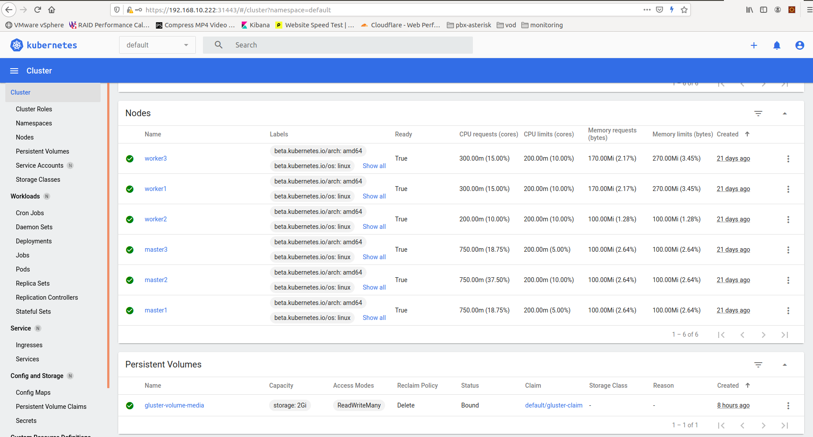

# Setup-Kubernet-Dashboard

Sử dụng Kubernet dashboard cho phép thực hiện các thao tác Kubernetes qua giao diện web.

**Step1: Install kubernetes-dashboard via the official "recommended" manifests file**

Check version dashboard để xem tính năng, cũng như tương thích version nào của docker: https://github.com/kubernetes/dashboard/releases

Thực hiện cài đặt dashboard v2.0.3 như sau:

`kubectl apply -f https://raw.githubusercontent.com/kubernetes/dashboard/v2.0.3/aio/deploy/recommended.yaml`

```
namespace/kubernetes-dashboard created
serviceaccount/kubernetes-dashboard created
service/kubernetes-dashboard created
secret/kubernetes-dashboard-certs created
secret/kubernetes-dashboard-csrf created
secret/kubernetes-dashboard-key-holder created
configmap/kubernetes-dashboard-settings created
role.rbac.authorization.k8s.io/kubernetes-dashboard created
clusterrole.rbac.authorization.k8s.io/kubernetes-dashboard created
rolebinding.rbac.authorization.k8s.io/kubernetes-dashboard created
clusterrolebinding.rbac.authorization.k8s.io/kubernetes-dashboard created
deployment.apps/kubernetes-dashboard created
service/dashboard-metrics-scraper created
deployment.apps/dashboard-metrics-scraper created
```
Check kubernetes dashboard pod đã tạo

`kubectl get pods -n kubernetes-dashboard `

|NAME                                         |READY   |STATUS    |RESTARTS   |AGE|
|---------------------------------------------|--------|----------|-----------|---|
|dashboard-metrics-scraper-7b59f7d4df-6f5j6   |1/1     |Running   |0          |5m6s|
|kubernetes-dashboard-5dbf55bd9d-dnll8        |1/1     |Running   |0          |5m7s|

**Step2: Create user to connect kubernetes-dashboard**

[https://github.com/kubernetes/dashboard/blob/master/docs/user/access-control/creating-sample-user.md](https://github.com/kubernetes/dashboard/blob/master/docs/user/access-control/creating-sample-user.md)

Tạo tệp tin admin-user.yaml

```
cat <<EOF>admin-user.yaml
---
apiVersion: v1
kind: ServiceAccount
metadata:
  name: keepwalking
  namespace: kubernetes-dashboard
---
apiVersion: rbac.authorization.k8s.io/v1
kind: ClusterRoleBinding
metadata:
  name: keepwalking
roleRef:
  apiGroup: rbac.authorization.k8s.io
  kind: ClusterRole
  name: cluster-admin
subjects:
- kind: ServiceAccount
  name: keepwalking
  namespace: kubernetes-dashboard
---
EOF
```

Thực hiện tạo user

`kubectl create -f admin-user.yaml`

```
[root@master1 ~]# kubectl create -f admin-user.yaml
serviceaccount/keepwalking created
clusterrolebinding.rbac.authorization.k8s.io/keepwalking created
```

**Step3: Retrieve the unique access token of admin user**

Để login Kubernetes dashboard với tài khoản admin, chúng ta cần cung cấp một token

`kubectl -n kubernetes-dashboard describe secret $(kubectl -n kubernetes-dashboard get secret | grep keepwalking | awk '{print $1}')`

```
Name:         keepwalking-token-gph8t
Namespace:    kubernetes-dashboard
Labels:       <none>
Annotations:  kubernetes.io/service-account.name: keepwalking
              kubernetes.io/service-account.uid: a065976e-2a6e-4aa8-a69e-c034932acdd3

Type:  kubernetes.io/service-account-token

Data
====
ca.crt:     1066 bytes
namespace:  20 bytes
token: eyJhbGciOiJSUzI1NiIsImtpZCI6IjFkdDVZZTV4LU1OTEI4SDM4UU5KcTR0OFd0YkJQTFlRZXBHU1BtM2JLUzQifQ.eyJpc3MiOiJrdWJlcm5ldGVzL3NlcnZpY2VhY2NvdW50Iiwia3ViZXJuZXRlcy5pby9zZXJ2aWNlYWNjb3VudC9uYW1lc3BhY2UiOiJrdWJlcm5ldGVzLWRhc2hib2FyZCIsImt1YmVybmV0ZXMuaW8vc2VydmljZWFjY291bnQvc2VjcmV0Lm5hbWUiOiJrZWVwd2Fsa2luZy10b2tlbi1ncGg4dCIsImt1YmVybmV0ZXMuaW8vc2VydmljZWFjY291bnQvc2VydmljZS1hY2NvdW50Lm5hbWUiOiJrZWVwd2Fsa2luZyIsImt1YmVybmV0ZXMuaW8vc2VydmljZWFjY291bnQvc2VydmljZS1hY2NvdW50LnVpZCI6ImEwNjU5NzZlLTJhNmUtNGFhOC1hNjllLWMwMzQ5MzJhY2RkMyIsInN1YiI6InN5c3RlbTpzZXJ2aWNlYWNjb3VudDprdWJlcm5ldGVzLWRhc2hib2FyZDprZWVwd2Fsa2luZyJ9.uLXlfHAduVpLSuhDtUyXjv2N5GQHgAcKje6Fz7NRcwltvWiVSHv7eWPoYiQ9MtXM4HmMX3VX4lI4mCOPRGz8-4cmxDFQ2SrHQXM4z4uoR_E1GLQydHzqFRQE3EcFLoNCdicjHTVGHcYFFmgJlX0YdnLdjutEIzy2Etwb-sytWuzwMvXnx6mm-RKeSbZXfRXbioWZmAthU8y94_-SYlB4v_r9u76iJg6TJuVprULiY-BaHswcBZ5jBJ5cQlJVVCWo-TcEaIbyR0llxTJqNVNQIZ7mgQrr96sr1h6QzagzzqQl5fSy_YfX2hUVRQjH64dwL7WCjv7C4PgxocOFUEITmA
```

**Step4: Make the dashboard a NodePort**

Patch trong quá trình tạo service kubernetes-dashboard

`kubectl patch svc -n kubernetes-dashboard kubernetes-dashboard -p '{"spec": {"type": "NodePort", "ports": [{"nodePort": 31443, "port": 443}] }}'`

Ở đây, chúng ta sẽ expose với port 31443 cho truy cập dashboard

**Step5: Connect to Kubernetes dashboard**

Truy cập https://192.168.10.222:31443 và vào thông tin token ở step3 cho login dashboard

<p align="center">

</p>
